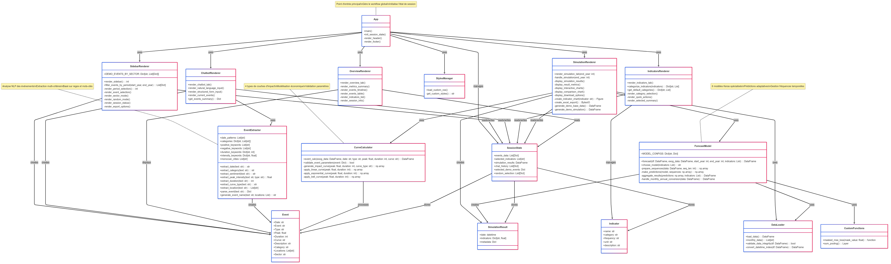
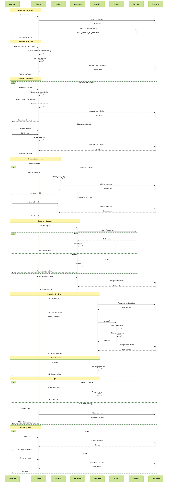
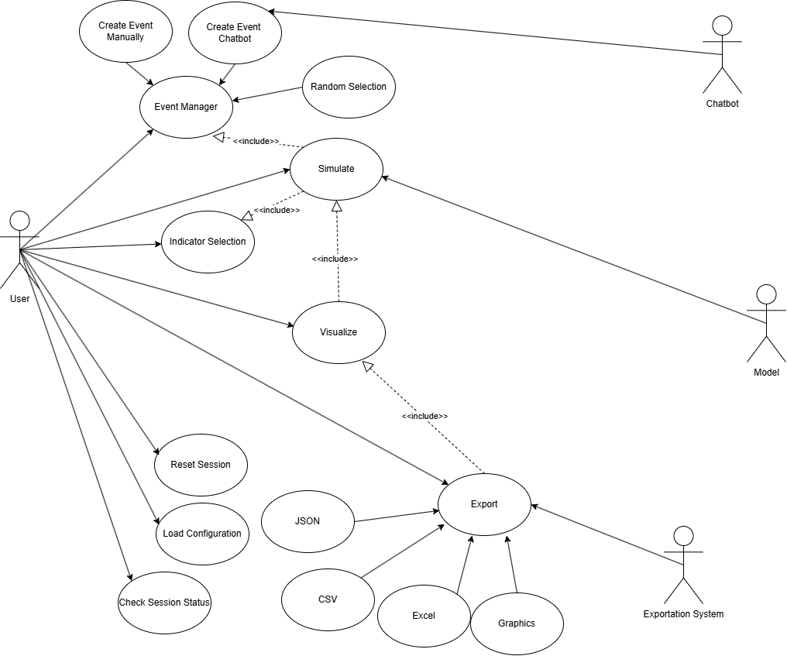

.. raw:: html

   

     
     <h1 style="margin: 0;">Diagrammes du Système</h1>
   

======================

Ce document présente les différents diagrammes UML utilisés pour modéliser l'architecture et le comportement du système de prévision économique marocain.

Diagramme de Classe
--------------------

Le diagramme de classe illustre les classes utilisées dans l'interface

   **Figure 2:** Diagramme de Classe montrant les classes d'interface

Diagramme de Séquence
--------------------

Le diagramme de séquence illustre les interactions entre les objets du système dans l'ordre chronologique, mettant en évidence le flux de contrôle entre différents composants lors de l'exécution du processus de prévision.

   
   **Figure 2:** Diagramme de séquence montrant le processus de prévision économique

Diagramme de Cas d'Utilisation
-----------------------------

Le diagramme de cas d'utilisation présente les interactions entre les utilisateurs et le système, définissant les fonctionnalités offertes et les scénarios d'utilisation possibles.

   
   **Figure 3:** Diagramme de cas d'utilisation du système de prévision économique
