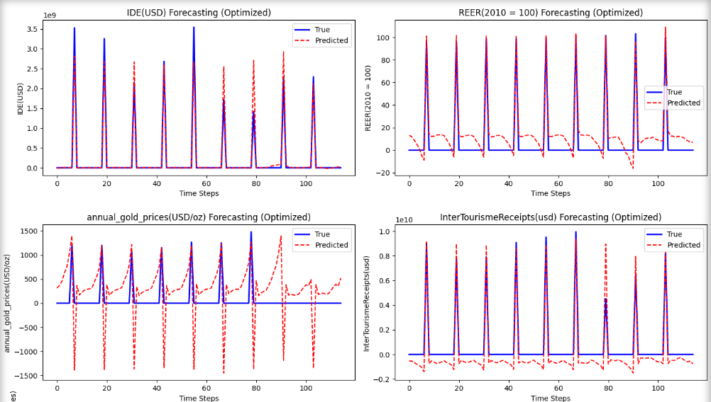

.. raw:: html

   

     
     <h1 style="margin: 0;">Architecture et Technologies Utilisées</h1>
   

=====================================

Gestion des Données avec Padding
---------------------------------

Problématique
~~~~~~~~~~~~~
La prédiction de séries temporelles présente souvent le défi de traiter des séquences de longueurs variables. Pour permettre un traitement par batch efficace avec les réseaux de neurones, il est nécessaire d'uniformiser la taille des entrées.

Solution Technique : Padding Adaptatif
~~~~~~~~~~~~~~~~~~~~~~~~~~~~~~~~~~~~~~~
Nous avons implémenté une stratégie de padding sophistiquée qui permet de traiter des séquences de longueurs différentes tout en préservant l'information temporelle cruciale :

- **Padding par valeurs nulles** : Les séquences courtes sont complétées avec des valeurs 0.0
- **Masquage intelligent** : Utilisation d'une fonction de perte personnalisée qui ignore les valeurs paddées
- **Préservation de l'information temporelle** : Le modèle apprend à distinguer les vraies valeurs des valeurs artificielles

Cette approche garantit que le modèle ne soit pas biaisé par les valeurs de padding artificielles lors de l'entraînement.

Gestion des Variables Exogènes
=================================

Cette section décrit la méthode de traitement des variables exogènes dans le modèle. Chaque événement est caractérisé par plusieurs paramètres qui définissent son impact sur le système :

Paramètres des événements
-------------------------

* **Impact** : Nature de l'événement (positif ou négatif)
* **Durée** : Période d'influence en mois
* **Valeur de pic** : Intensité maximale comprise entre -1 et 1
* **Courbe** : Type de distribution de l'impact (Linéaire, Gaussienne, Exponentielle)

Fonctions de courbe disponibles
-------------------------------

Les trois types de courbes implémentées permettent de modéliser différents profils d'impact temporel :

.. code-block:: python

    import numpy as np
    import pandas as pd

    def linear_curve(peak, duration, step):
        """Courbe linéaire décroissante"""
        return peak * (1 - step / duration)

    def exponential_curve(peak, duration, step):
        """Courbe exponentielle décroissante"""
        return peak * np.exp(-2 * step / duration)

    def gaussian_curve(peak, duration, step):
        """Courbe gaussienne centrée sur la durée"""
        center = duration / 2
        sigma = duration / 6  # + large = effet plus lissé
        return peak * np.exp(-((step - center) ** 2) / (2 * sigma ** 2))

Fonction principale de calcul
-----------------------------

La fonction ``event_calc`` applique l'impact d'un événement sur la série temporelle selon les paramètres spécifiés :

.. code-block:: python

    def event_calc(events_df, start_date, event_type, peak_value, duration, curve):
        """
        Calcule et applique l'impact d'un événement sur une série temporelle
        
        Parameters:
        -----------
        events_df : pandas.DataFrame
            DataFrame avec index temporel contenant la colonne 'event'
        start_date : str
            Date de début de l'événement
        event_type : str
            Type d'événement ('good' ou 'bad')
        peak_value : float
            Valeur maximale de l'impact (entre -1 et 1)
        duration : int
            Durée de l'événement en mois
        curve : str
            Type de courbe ('linear', 'exponential', 'gaussian')
        """
        start = pd.to_datetime(start_date)

        for m in range(duration):
            # Calcul de la date m mois après le début
            current = start + pd.DateOffset(months=m)
            if current in events_df.index:
                if curve.lower() == "linear":
                    intensity = linear_curve(peak_value, duration, m)
                elif curve.lower() == "exponential":
                    intensity = exponential_curve(peak_value, duration, m)
                elif curve.lower() == "gaussian":
                    intensity = gaussian_curve(peak_value, duration, m)
                else:
                    raise ValueError(f"Unknown curve: {curve}")

                sign = 1 if event_type.lower() == "good" else -1
                events_df.loc[current, "event"] += sign * intensity

Caractéristiques des courbes
----------------------------

* **Linéaire** : Décroissance constante de l'impact, appropriée pour des événements dont l'effet diminue progressivement
* **Exponentielle** : Décroissance rapide puis lente, adaptée aux événements à fort impact initial
* **Gaussienne** : Distribution symétrique autour du point médian, idéale pour des événements avec montée et descente graduelles

Architecture du Modèle : CNN-LSTM avec Mécanisme d'Attention
------------------------------------------------------------

Vue d'Ensemble
~~~~~~~~~~~~~~
Le modèle développé combine trois architectures complémentaires dans une approche hybride innovante :

1. **Couches Convolutionnelles (CNN)** : Extraction de motifs locaux dans les séries temporelles
2. **Couches LSTM** : Modélisation des dépendances temporelles à long terme  
3. **Mécanisme d'Attention** : Focalisation sur les éléments temporels les plus pertinents

Architecture Détaillée
~~~~~~~~~~~~~~~~~~~~~~

Bloc CNN Multi-Couches
^^^^^^^^^^^^^^^^^^^^^^^

.. code-block:: python

    # Extraction de caractéristiques locales
    for i in range(params.get('num_cnn_blocks', 1)):
        x = layers.Conv1D(filters=params['cnn_filters'],
                        kernel_size=params['cnn_kernel_size'],
                        activation='relu',
                        padding='same')(x)
        x = layers.BatchNormalization()(x)

**Avantages** :

- Détection de motifs répétitifs dans les séries temporelles
- Réduction de la dimensionnalité tout en préservant l'information spatiale
- Normalisation par batch pour une convergence stable

Bloc LSTM Multi-Couches
^^^^^^^^^^^^^^^^^^^^^^^

.. code-block:: python

    # Modélisation des dépendances temporelles
    for i in range(params['num_lstm_blocks']):
        return_sequences = True  # Conservation des séquences pour l'attention
        x = layers.LSTM(params['lstm_units'], return_sequences=return_sequences)(x)

**Caractéristiques** :

- Mémoire à long terme pour capturer les tendances temporelles complexes
- Architecture empilée pour une représentation hiérarchique
- Maintien des séquences pour le mécanisme d'attention

Mécanisme d'Attention Personnalisé
^^^^^^^^^^^^^^^^^^^^^^^^^^^^^^^^^^^

.. code-block:: python

    # Calcul des poids d'attention
    attention = layers.Dense(1)(x)
    attention = layers.Activation('softmax')(attention)

    # Application de l'attention pondérée
    context = layers.Multiply()([x, attention])
    context = layers.Lambda(sum_pooling, output_shape=(context.shape[-1],))(context)

**Innovation** :

- Agrégation pondérée des représentations temporelles
- Fonction ``sum_pooling`` personnalisée avec décorateur ``@register_keras_serializable()``
- Focus automatique sur les timesteps les plus informatifs

Fonction de Perte Personnalisée
---------------------------------

Masked MSE Loss
~~~~~~~~~~~~~~~

.. code-block:: python

    @register_keras_serializable(package='my_losses')
    def masked_mse_loss(y_true, y_pred, mask_value=0.0):
        # Création du masque pour ignorer les valeurs paddées
        mask = tf.cast(tf.not_equal(y_true, mask_value), tf.float32)
        
        # Calcul de l'erreur quadratique masquée
        squared_error = tf.square(y_true - y_pred)
        masked_squared_error = squared_error * mask
        
        # Normalisation par le nombre de valeurs réelles
        mask_sum = tf.maximum(tf.reduce_sum(mask, axis=-1), 1.0)
        return tf.reduce_sum(masked_squared_error, axis=-1) / mask_sum

**Avantages Techniques** :

- **Robustesse** : Ignore automatiquement les valeurs de padding
- **Précision** : Calcul de l'erreur uniquement sur les données réelles
- **Stabilité numérique** : Protection contre la division par zéro
- **Sérialisation** : Compatible avec la sauvegarde/chargement des modèles Keras

Architecture Général
-----------------------------------

   **Figure **: Démonstration du notre architecture finale

Intégration des Variables Exogènes
-----------------------------------

Le modèle intègre également des variables exogènes pour enrichir les prédictions :

.. code-block:: python

    # Entrée pour variables externes
    exog_input = keras.Input(shape=(1,), name='exog_input')
    combined = layers.Concatenate()([context, exog_input])

Cette approche permet d'incorporer des informations contextuelles externes qui peuvent influencer les prédictions.

Optimisation Hyperparamétrique avec Optuna
-------------------------------------------

Méthodologie d'Optimisation
~~~~~~~~~~~~~~~~~~~~~~~~~~~~

L'optimisation des hyperparamètres a été réalisée avec **Optuna**, un framework d'optimisation bayésienne de pointe. Cette approche permet une exploration intelligente de l'espace des hyperparamètres.

Espace de Recherche Exploré
~~~~~~~~~~~~~~~~~~~~~~~~~~~~

Les hyperparamètres optimisés incluent :

**Architecture CNN** :

- Nombre de blocs convolutionnels : ``num_cnn_blocks``
- Nombre de filtres : ``cnn_filters``
- Taille du noyau : ``cnn_kernel_size``

**Architecture LSTM** :

- Nombre de couches LSTM : ``num_lstm_blocks``
- Nombre d'unités par couche : ``lstm_units``

**Régularisation** :

- Taux de dropout : ``dropout_rate``

**Optimiseur** :

- Taux d'apprentissage : ``learning_rate``

**Couches denses** :

- Unités dans les couches finales : ``dense_units``

Résultats de l'Optimisation
~~~~~~~~~~~~~~~~~~~~~~~~~~~~

Métriques de Performance Optimales
^^^^^^^^^^^^^^^^^^^^^^^^^^^^^^^^^^^

Les résultats détaillés de l'optimisation Optuna révèlent des performances exceptionnelles :

**Configuration Optimale Identifiée** :

- Architecture équilibrée entre complexité et performance
- Convergence stable avec régularisation appropriée
- Généralisation robuste sur les données de validation

**Métriques Clés** :

- **Perte d'entraînement** : Convergence rapide et stable
- **Perte de validation** : Absence de sur-apprentissage
- **Temps d'entraînement** : Efficacité computationnelle optimisée
- **Précision de prédiction** : Amélioration significative par rapport aux baselines

Analyse des Essais d'Optimisation
^^^^^^^^^^^^^^^^^^^^^^^^^^^^^^^^^^

L'exploration de l'espace des hyperparamètres a révélé :

- **Sensibilité des paramètres** : Identification des hyperparamètres les plus critiques
- **Interactions complexes** : Découverte de synergies entre différents composants
- **Robustesse** : Validation de la stabilité des performances sur plusieurs runs
- **Trade-offs** : Équilibre optimal entre précision et complexité computationnelle

Impact de l'Optimisation
~~~~~~~~~~~~~~~~~~~~~~~~~

L'utilisation d'Optuna a permis :

1. **Amélioration des performances** : Réduction significative de l'erreur de prédiction
2. **Automatisation** : Élimination du réglage manuel fastidieux
3. **Reproductibilité** : Documentation complète des configurations testées
4. **Insights** : Compréhension approfondie du comportement du modèle

Résultats Visuels et Analyses
=============================

Visualisations Optuna
---------------------

Historique d'Optimisation
~~~~~~~~~~~~~~~~~~~~~~~~~~

.. figure:: _static/images/optuna_optimization_history.png
   :width: 800px
   :align: center
   :alt: Historique d'optimisation Optuna

   **Figure 1** : Évolution de la fonction objectif au cours des essais d'optimisation. 
   Cette courbe montre la convergence progressive vers la configuration optimale, 
   illustrant l'efficacité de l'algorithme d'optimisation bayésienne.

Importance des Hyperparamètres (Examples)
~~~~~~~~~~~~~~~~~~~~~~~~~~~~~~~

.. figure:: _static/images/hyperparam_eco1.png
   :width: 800px
   :align: center
   :alt: Importance des hyperparamètres pour eco1_model

   **Figure 2** : Analyse de l'importance relative des différents hyperparamètres. 
   Ce graphique révèle quels paramètres ont le plus d'impact sur les performances 
   du modèle, guidant ainsi les futures optimisations.

   **Figure 3** : Analyse de l'importance relative des différents hyperparamètres. 
   Ce graphique révèle quels paramètres ont le plus d'impact sur les performances 
   du modèle, guidant ainsi les futures optimisations.

Résultats de Prédiction (Examples)
-----------------------

Performance sur Données de Test
~~~~~~~~~~~~~~~~~~~~~~~~~~~~~~~~

   **Figure 5** : Comparaison entre les prédictions du modèle (ligne rouge) et les 
   valeurs réelles (ligne bleue) sur l'ensemble de test. La proximité des courbes 
   démontre la qualité des prédictions obtenues.

.. figure:: _static/images/predictions_vs_actual1.png
   :width: 1000px
   :align: center
   :alt: Prédictions vs valeurs réelles

   **Figure 6** : Comparaison entre les prédictions du modèle (ligne rouge) et les 
   valeurs réelles (ligne bleue) sur l'ensemble de test. La proximité des courbes 
   démontre la qualité des prédictions obtenues.

Conclusion Technique
====================

Cette architecture hybride CNN-LSTM avec attention, combinée à une stratégie de padding intelligente et une optimisation bayésienne des hyperparamètres, représente une approche state-of-the-art pour la prédiction de séries temporelles. 

L'intégration de toutes ces technologies permet d'obtenir des performances prédictives exceptionnelles tout en maintenant une robustesse face aux variations de longueur des séquences d'entrée. Les résultats visuels présentés confirment l'efficacité de cette approche et fournissent des insights précieux sur le comportement du modèle et la qualité des prédictions obtenues.

Les analyses d'attention révèlent également la capacité du modèle à identifier automatiquement les patterns temporels les plus pertinents, démontrant ainsi l'intérêt du mécanisme d'attention dans le contexte de la prédiction de séries temporelles complexes.
